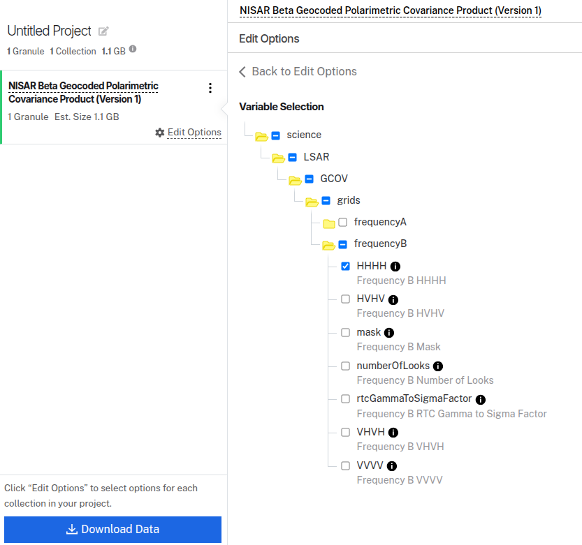
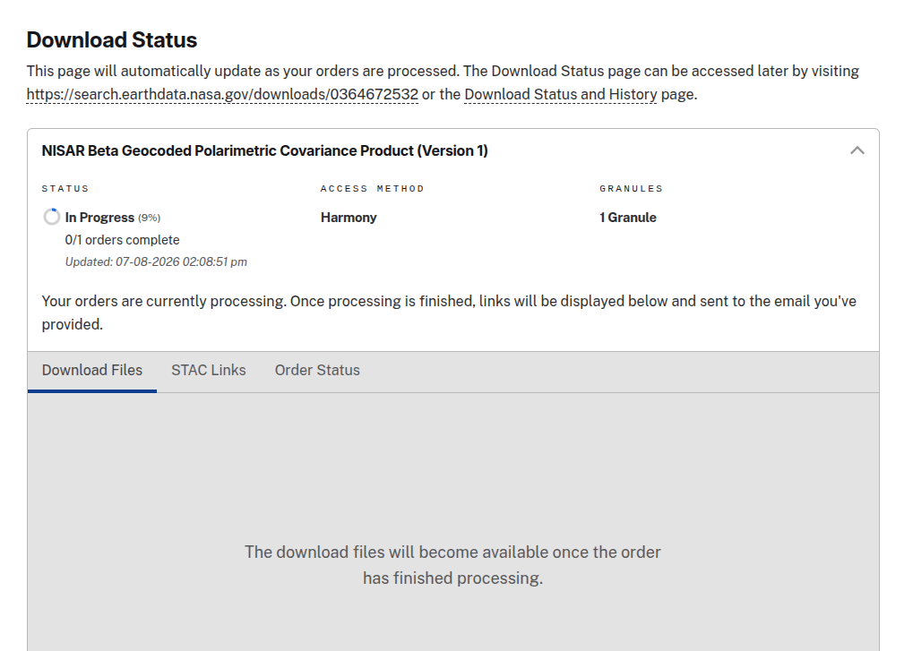

# NISAR GCOV Layer Extraction

This tutorial walks through extracting single layers as GeoTIFFs from NISAR [Geocoded Polarimetric Covariance (GCOV)](https://nisar-docs.asf.alaska.edu/gcov/) products. GCOV products are natively stored in [HDF5](http://nisar-docs.asf.alaska.edu/data-format/) format.

GCOV Layer extraction is the first step in creating a comprehensive suite of services for NISAR data.
See the [ASF Roadmap](https://nisar-docs.asf.alaska.edu/roadmap/) for a timeline of upcoming services!

## Extract Layers Locally

The process for opening and extracting layers from NISAR files locally is covered in the [Local NISAR Layer Extraction](local-nisar-layer-extraction.ipynb) notebook.

## Earthdata Search

1. Go to [Earthdata Search](https://search.earthdata.nasa.gov/search?q=GCOV) and locate the `NISAR_L2_GCOV_BETA_V1` collection.
2. To find only quad-pol granules, use a granule wildcard search. Under **Granule ID(s)**, enter:
   ```
   NISAR_L2_PR_GCOV*QPDH*N_P_J_001
   ```
3. Find a GCOV granule and add it to your project.
4. Click **Customize with Harmony**, then select **net2cog**.
5. Select a variable, e.g. `science/LSAR/GCOV/grids/frequencyB/HHHH`.

   

6. Select **GEOTIFF** as the output format.
7. Click **Download Data** and wait for the Harmony job to finish.

   

8. Download the files using the provided link or **Earthdata Download**.

## Harmony-Py

`harmony-py` is used to programmatically submit Harmony jobs. The [NISAR Layer Extraction](nisar-layer-extraction.ipynb) notebook shows the basic workflow, and more examples are available in the [harmony-py docs](https://github.com/nasa/harmony-py).

For a live view of your Harmony jobs, see the [Workflow UI](https://harmony.earthdata.nasa.gov/workflow-ui).
